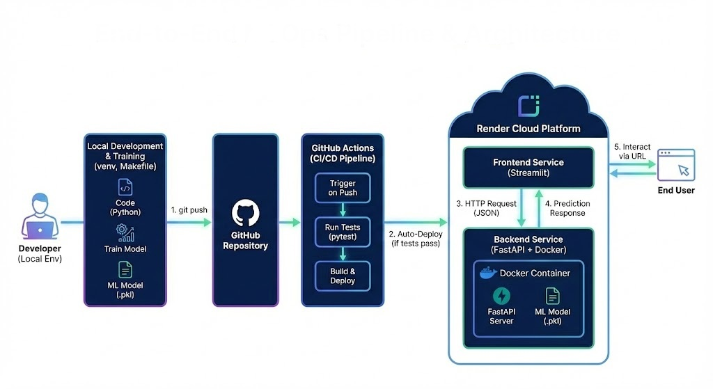

# Cloud-Native MLOps Pipeline 🚀

A decoupled machine learning deployment MVP built to focus entirely on infrastructure, CI/CD, and containerization.

## 🏗️ Architecture

* **Backend (Inference):** FastAPI, Scikit-learn, Docker
* **Frontend (UI):** Streamlit
* **CI/CD & Cloud:** GitHub Actions, Pytest, Render

## ⚙️ Quick Start
Clone the repo and use the Makefile to run locally:
\`\`\`bash
make install
make run
\`\`\`

## 🌍 Live Links
* **Frontend UI:** [https://iris-classifier-pipeline-frontend.onrender.com/](https://iris-classifier-pipeline-frontend.onrender.com/)
* **Backend API Docs:** [https://iris-classifier-pipeline.onrender.com/docs](https://iris-classifier-pipeline.onrender.com/docs)
  
*Passionate about infrastructure since day one.*
